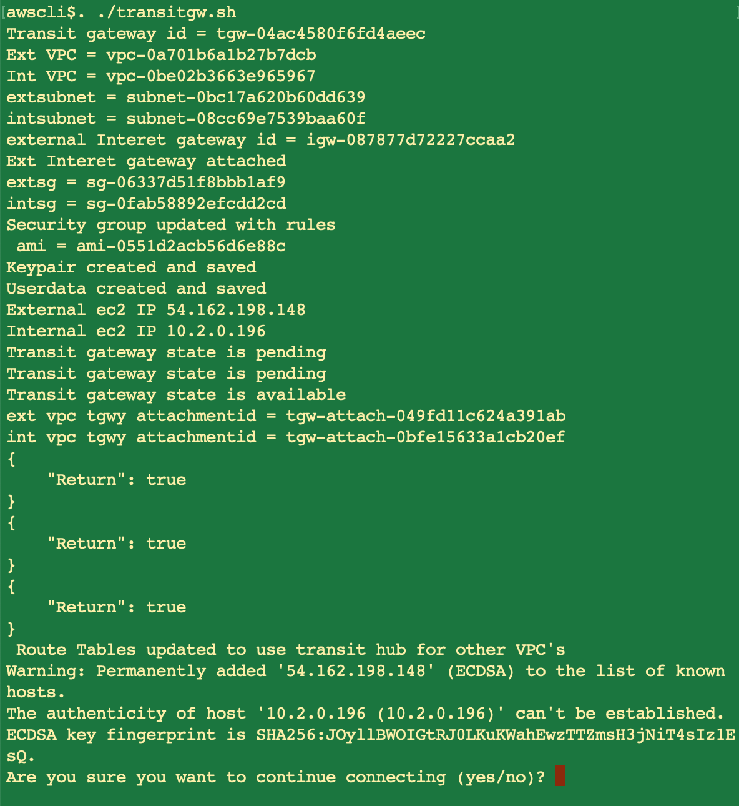

Introduction of AWS Transit-gateway

 This repo explains the usage Transit gateway
 
 
 For Live demo, set up aws cli and download and run script like below
 
 ```
 wget https://raw.githubusercontent.com/aws-tutorials/transit-gateway/main/transitgw.sh
 . ./transitgw.sh
 ```
 
 
 
 
 
 
 
 

